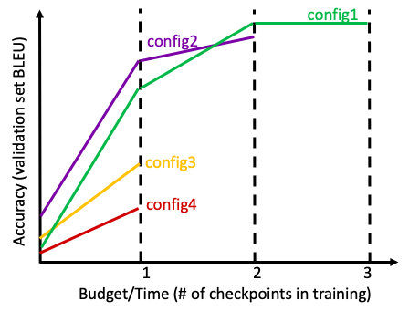

## Hyperparameter Optimization with Asynchronous Successive Halving Algorithm (ASHA)

This example implements ASHA for Sockeye. 
ASHA is a bandit learning algorithm that looks at the learning curves of multiple training runs. 
Not-so-promising runs are terminated early, in order to allocate more computational resources to promising runs. 
It balances exploration (trying new configurations) with exploitation (training promising configurations for longer). 

The figure below illustrates the concept of Successive Halving. 
Suppose four configurations are run. At checkpoint 1, we terminate config 3 and config 4 because they have the worst BLEU scores so far. 
We promote the better half, config 1 and config 2. This halving repeats again at checkpoint 2, and in the end only config 1 is run to completion. 
The method assumes that learning curves are comparable at intermediate points, and is efficient by spending compute resources only on promising configurations. 



ASHA is the asychronous version of the Successive Halving algorithm. For more info, refer to:
* Paper: Liam Li. et. al., [A System for Massively Parallel Hyperparameter Tuning](https://arxiv.org/pdf/1810.05934.pdf)), Proc. of ML & Sys, 2020 
* [Blog post](https://blog.ml.cmu.edu/2018/12/12/massively-parallel-hyperparameter-optimization/) by the original authors

### Usage overview:

There are 4 steps: 
1. Design hyperparameter space (space.yaml)
2. Generate actual configurations as hpm files
3. Run ASHA
4. Analyze stored results

### 1. Hyperparameter space

The file `space1/hpm-space.yaml` gives an example hyperparameter space. 
It is similar to that of [egs/gridsearch](../gridsearch).
The most common hyperparameters are in the example, but the toolkit is flexible to any user-defined hyperparameter. 

For example, the snippet below says that the user wishes to search over two options for `bpe_symbols_src`, one option for `bpe_symbols_trg`, and three options for `transformer_model_size`. Make sure to change the `rootdir` in `hpm-space.yaml` to your local installation of sockeye-recipes3, `workdir` to this directory (e.g. `$rootdir/egs/asha/space1/`), and `train_tok`/`valid_tok` to the data paths in your own settings; absolute paths are recommended since this is the blueprint from generating various hpm files, which may be moved around. 

```
workdir: /exp/xzhang/sockeye-recipes3/egs/asha/space1/
rootdir: /exp/xzhang/sockeye-recipes3/
src: zh
trg: en
train_tok: /exp/xzhang/sockeye-recipes3/egs/ted/multitarget-ted/en-zh/tok/ted_train_en-zh.tok.clean
valid_tok: /exp/xzhang/sockeye-recipes3/egs/ted/multitarget-ted/en-zh/tok/ted_dev_en-zh.tok
bpe_symbols_src:
- 30000
- 10000
bpe_symbols_trg:
- 30000
transformer_model_size: [256, 512, 1024]
..
```

For this example (TED ZH-EN), we assume the bitext is unpacked. If not, follow the instructions in [egs/ted](../ted) Setup:

```
cd ../ted
sh ./0_download_data.sh
sh ./1_setup_task.sh zh
cd ../asha
```

### 2. Generate configurations (hpm files)

First, we use `generate_hpm.py` to generate the Cartesian product of all hyperparameter choices (like in gridsearch). 

```
cd space1
conda activate sockeye3
python ../../../automl/generate_hpm.py hpm-space.yaml 
```

We can then prepare the data with BPE/Sentpiece by running:

```
mkdir -p data-bpe
/bin/sh prep.sh
```

Next, we will sample a subset of the hpm files for an actual run.
In the following, the subdir run1 will perform ASHA for up to 20 hpm files.
On the other hand, the subdir run2 will use all the 144 hpm files. 
The reason for this extra manual step is to allow for different kinds of hyperparameter optimization experiments.

```
mkdir -p hpms
mv *.hpm hpms/
python ../../../automl/generate_hpm_subspace.py run1 20 
python ../../../automl/generate_hpm_subspace.py run2 144
ls run1/hpms/*.hpm
```

Observe there are 20 random hpm files in `space1/run1/hpms/`, sampled from `space1/hpms/`.
We can also manually add any other hpm file to the subdirectory if we want it to be included in the optimization.

### 3. Run ASHA

Now, let's focus on run1. 
The main program for ASHA is in `$rootdir/automl/run_asha.py`.
An example script is in `$rootdir/automl/submit_run_asha.sh`; let's copy and modify it for our situation. 

```
cd run1
cp $rootdir/automl/submit_run_asha.sh .
vi submit_run_asha.sh
```

Note that the script looks like below; make sure to modify rootdir to your sockeye-recipes3 root. 

```
#!/bin/sh

rootdir=/exp/xzhang/sockeye-recipes3/
rundir=$rootdir/egs/asha/space1/run1

python $rootdir/automl/run_asha.py \
                    -r 1 \
                    -u 1 \
                    -R 6\
                    -p 2 \
                    -G 4 \
                    --timer-interval 90 \
                    --workdir $rootdir/egs/asha/space1/run1 \
                    --job-log-dir $rundir/job_logs \
                    --ckpt $rundir/ckpt.json \
                    #--multi-objective \
                    #--resume-from-ckpt $rundir/ckpt.json
```

The flags for `run_asha.py` are: 

| run_asha.py flag | description |
| ---------------- | ----------- |
| r | Min checkpoint per config |
| u | Number of checkpoints trained per config per rung | 
| R | Max checkpoint per config |
| p | Reduction rate. Top 1/p configurations are promoted |
| G | Number of GPUs available |
| timer-interval | Number of seconds to wait for run_asha.py to check job status |
| workdir | the working directory (this directory) | 
| job-log-dir | location of job submission logs |
| multi-objective | If flag is set, joint bleu + inference speed is optimized. |
| resume-from-ckpt | Path of ckpt.json file generated by previous ASHA runs, for continuation |

ASHA performs "halving" at each "rung." If the flag p=2, then half of the configurations are promoted. If p=3, 1/3 of the configurations are promoted. p={2,3,4} are common values. 
The flag -r specifies how many checkpoints are in the first rung of ASHA. 
The flag -u specifies how many checkpoints are in each subsequent rung. 
The flag -R says no configuration may be trained more than that many checkpoints. 

Together, these should be set in consideration with the actual number of batches per checkpoint (`checkpoint_interval` in the hpm file). The recommendation is to set -r at the point when you think learning curves start to become comparable. -u and -R are perhaps less sensitive. Please modify `submit_run_automl.sh` it according to your local setup. 

We also need to specify the qsub commands for the actual training and validation jobs. Copy the example and modify it according to your needs. 

```
cp $rootdir/automl/qsub.sh .
vi qsub.sh
```

The first line of qsub.sh specifies the training job dispatch command. Make sure the train.sh has the right path. 

The third line of qsub.sh specifies the validation job. Make sure translate.sh and the input validation set have the right paths.

Once that is ready, we can start ASHA, sit back, and relax! 

```
/bin/sh submit_run_automl.sh
```

### 4. Analyze results

We can check out `ckpt.json` at any time for the status of the ASHA run. 
Here is an example snippet:

```
{'asha': {'blacklist': [], # hpm's may be blacklisted if it constantly fails to train
          'config_states': {'0': {'bleu': 0.9, # config_states record the state of each config
                                  'bleus': [0.9], 
                                  'converged': False,
                                  'gpu_time': 79,
                                  'gpu_times': [79],
                                  'rung': 0}, # e.g. config0 is at rung 0 and best bleu/time are 0.9/79
                            '10': {'bleu': 1.9, 
                                   'bleus': [1.2, 1.9], 
                                   'converged': False,
                                   'gpu_time': 125,
                                   'gpu_times': [88, 125],
                                   'rung': 1}, # e.g. config10 is at rung 1 and best bleu/time are 1.9/125
...
          'i2h': {'0': 'egs/asha/space1/run1/hpms/109.hpm', # ASHA has an internal integer mapping for configs: 
                  '10': 'egs/asha/space1/run1/hpms/98.hpm', # config0 is 109.hpm, config10 is 98.hpm. config file can be any string.
...
    'rung_states': {'0': {'finished': [1, # rung states indicate the progress at each rung. Multiple rungs may be active due to asynchronity
                                             11, # e.g. configs 1, 17, 18, etc. are already finished at rung 0
                                             17,
                                             18,
                                             15],
...
                                'running': []}, # currently no running jobs for rung 0
...
```

We can also look at `log`. The example snippet below shows that results of each rung of ASHA. 
For example, we see that config 17 (ID=17, corresponding to 142.hpm) is the last remaining job and has a BLEU of 12.5
The penultimate rung (Rung 3) also included config 15, and the one before additionally included config 4, 7, 12. 
By observing the intermediate BLEU scores, we see how only the top half is promoted at each rung. 

```
Rung 0:
Finished Jobs   109       122       69        63        28        71        37        56        90        97
Ids             0         1         2         3         4         5         6         7         8         9
BLEU            0.9       0.9       0.1       0.7       2.7       1.3       1.2       2.6       0.1       2.5

Finished Jobs   98        143       110       30        104       13        78        142       101       65
Ids             10        11        12        13        14        15        16        17        18        19
BLEU            1.2       0.4       2.3       0.8       0.7       4.6       0.6       5.1       1.2       1.8

--------------------
Rung 1:
Finished Jobs   28        71        37        56        97        98        110       13        142       101
Ids             4         5         6         7         9         10        12        15        17        18
BLEU            4.4       1.2       3.8       4.4       4.1       1.9       4.2       6.8       7.5       1.5

Finished Jobs   65
Ids             19
BLEU            1.9

--------------------
Rung 2:
Finished Jobs   28        56        110       13        142
Ids             4         7         12        15        17
BLEU            6.6       7.1       6.6       9.6       10.1

--------------------
Rung 3:
Finished Jobs   13        142
Ids             15        17
BLEU            11.3      11.9

--------------------
Rung 4:
Finished Jobs   142
Ids             17
BLEU            12.5
```

Finally, if desired, we can run post-hoc analysis on all the training run logs. 
Please refer to `posthoc_analysis.py` instructions in [egs/gridsearch](../gridsearch)

ASHA may generate many files. To clean up diskspace: 
```
python $rootdir/scripts/cleanup.py $rootdir/egs/asha/space1/run1/models/
```